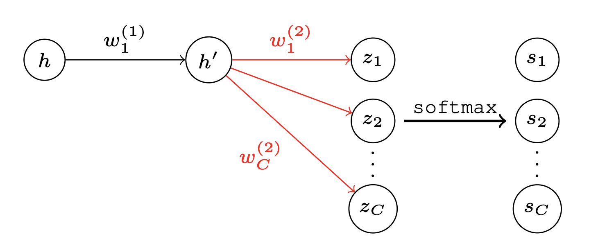
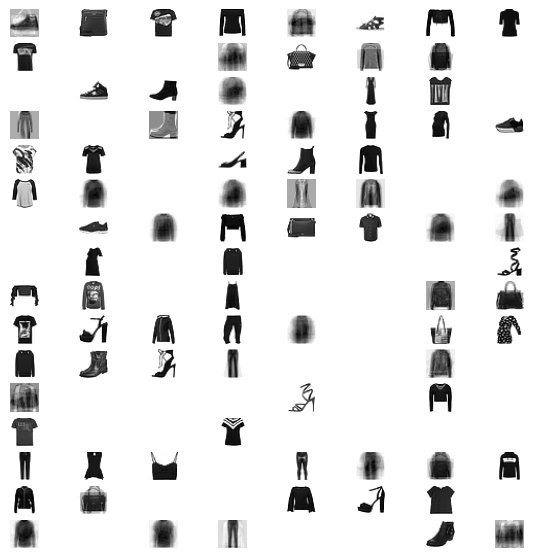

# 🛡️ Privacy Backdoors: Stealing Datasets from Pretrained Models

> Inspired by the paper: [Privacy Backdoor: Stealing Datasets from Pretrained Models (arXiv:2404.00473)](https://arxiv.org/pdf/2404.00473)



This repository demonstrates how pretrained models downloaded from open-source platforms (e.g., HuggingFace) can be backdoored to leak sensitive datasets during fine-tuning.

---

## 🔒 Threat Model

- Focus: **Privacy leakage**, not data integrity.
- Attack type: **White-box backdoor** inserted during initial training.
- Real-world risk: Public model hubs like HuggingFace host over 500K models from various contributors, increasing the surface for malicious uploads.

The attacker modifies the model weights to silently extract private data during future fine-tuning.

---

## 📦 Setup

Install required dependencies:

```bash
pip install -r requirements.txt
```

## 🧪 Scenarios

1. Train a Backdoored Model (MLP with MNIST)
Adds a backdoor (data trap) and saves both the model and trap neuron positions.

```shell
  python3 model_training.py
```

2. Fine-Tune the Model (with Fashion-MNIST as example)
Simulates the victim fine-tuning a model unaware of the backdoor.

```shell
python3 model_finetuned.py
```

3. Recover the Private Dataset
Extract the fine-tuned data using gradients.

Open and run:

```shell
 recover_data.ipynb
```

## 🧠 Backdoor Mechanism: How It Works

This implementation uses the white-box attack described in the paper.

Neuron Update:
Let the hidden neuron output be:

$$
  h = ReLU(w^Tx+b)
$$

Gradient update during backpropagation:

$$
\nabla_w L = \frac{\partial L}{\partial h} \cdot x, \quad
\nabla_b L = \frac{\partial L}{\partial h}
$$

We scale the output with a large constant c:

$$
   h` = ReLU(c * h)
$$

This ensures:

- A large gradient update for a specific data point.

- The neuron becomes inactive (dead) afterward (ReLU = 0).

- This acts as a data trap, triggered only by one unique input.

Dataset Recovery:

From gradients after fine-tuning:

$$
\frac{\nabla_w L}{\nabla_b L} = x
$$

🖼️ Recovered Examples

From 128 corrupted neurons, the following images were recovered:



## 🔚 Conclusion

This project demonstrates a practical privacy threat in sharing pretrained models.
Don't trust any unknown uploaded models , only from trusted sides.

## 📄 Reference

- <https://github.com/ShanglunFengatETHZ/PrivacyBackdoor>
- <https://github.com/armand-07/dataset_stealing_with_privacy_doors>
